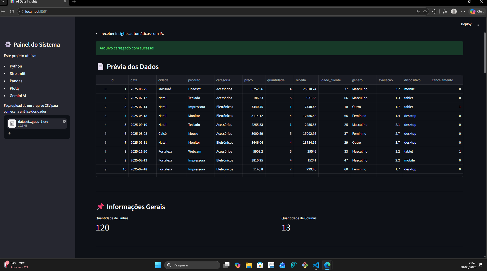
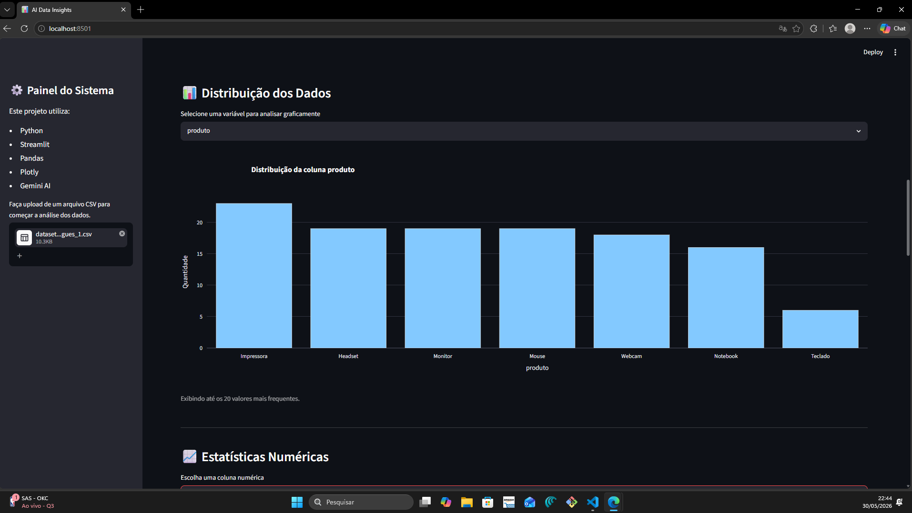
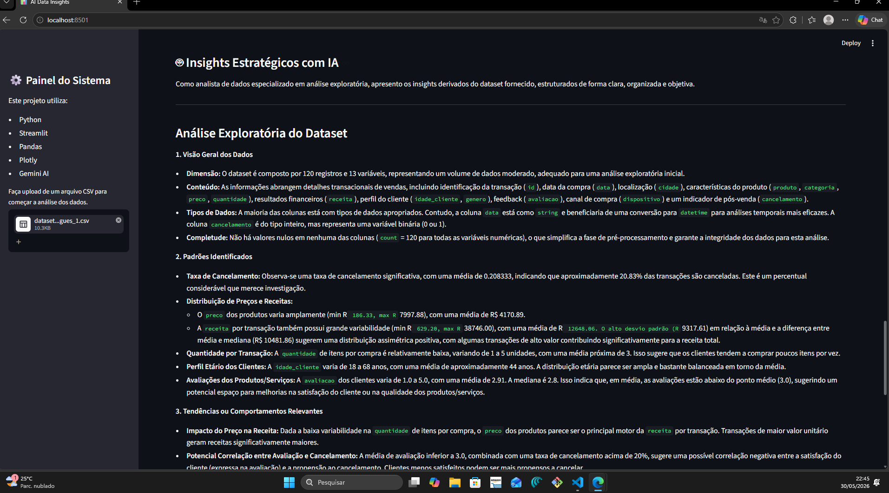

# 📊 AI Data Insights Dashboard

> Transformando arquivos CSV em insights acionáveis com análise automatizada e IA generativa.
Tecnologias:
Python • Streamlit • Pandas • Plotly • Gemini

Status:
✅ MVP funcional

## 📝 Planejamento Inicial

Antes do desenvolvimento, foi elaborado um rascunho de planejamento para definir:

- escopo do MVP;
- prioridades de desenvolvimento;
- arquitetura inicial;
- etapas de aprendizado necessárias;
- cronograma de execução.

Esse planejamento serviu como guia para as decisões tomadas durante o projeto.


---

## 🎯 Problema que resolve

Analistas e gestores frequentemente recebem arquivos CSV com dados brutos e precisam de tempo e conhecimento técnico para extrair valor deles. Este projeto permite que **qualquer pessoa** faça upload de um CSV e obtenha:
- uma visão geral dos dados;
- gráfico visual;
- estatísticas descritivas;
- insights automáticos gerados por IA.
O objetivo é reduzir a barreira entre "ter dados" e "entender dados".

---

## ✨ Funcionalidades

| Funcionalidade | Descrição |
|---|---|
| 📁 Upload de CSV | Carrega qualquer arquivo CSV diretamente na interface |
| 🔍 Visualização dos dados | Exibe a tabela completa com scroll |
| 📈 Visualizações gráficas | Gráfico de barras e histograma com Plotly
| 📊 Estatísticas descritivas | Média, mediana, desvio padrão e mais |
| 🤖 Insights automáticos | Análise gerada automaticamente com regras |
| 💡 Insights com IA | Insights estratégicos gerados pela API do Google Gemini |

---

## 🛠️ Stack utilizada

| Tecnologia | Papel no projeto |
|---|---|
| Python | Linguagem principal |
| Streamlit | Framework para a interface web |
| Pandas | Leitura e análise dos dados |
| Plotly | Visualizações interativas |
| Google Gemini API | Geração de insights com IA generativa |
| Git / GitHub | Versionamento e publicação |

---

## 🚀 Como rodar localmente

### Pré-requisitos

- Desenvolvido e testado em Python 3.11
- Uma chave de API do [Google Gemini](https://aistudio.google.com/app/apikey) (gratuita)

### Passo a passo

**1. Clone o repositório**
```bash
git clone https://github.com/SEU_USUARIO/ai-data-insights.git
cd ai-data-insights
```

**2. Crie e ative um ambiente virtual** *(recomendado)*
```bash
python -m venv venv

# Windows
venv\Scripts\activate

# Mac/Linux
source venv/bin/activate
```

**3. Instale as dependências**
```bash
pip install -r requirements.txt
```

**4. Configure sua chave de API**

Crie um arquivo `.env` na raiz do projeto:
```
GEMINI_API_KEY=sua_chave_aqui
```

> ⚠️ Nunca suba esse arquivo para o GitHub. Ele já está no `.gitignore`.

**5. Rode a aplicação**
```bash
streamlit run app.py
```

Acesse no navegador: `http://localhost:8501`

---

## 📂 Estrutura do projeto

```
ai-data-insights/
│
├── app.py                  # Interface principal Streamlit
├── README.md               # Documentação do projeto
├── test_gemini.py          # Testes da integração Gemini
├── .env                    # Chaves da API (não enviado ao GitHub)
├── .gitignore
│
├── utils/
│   ├── insights.py         # Insights automáticos simples
│   ├── ai_insights.py      # Integração com Gemini
│   └── charts.py           # Funções para gráficos
│
└── images/                # Capturas de tela do projeto


```


> A separação em `utils/` foi uma decisão consciente para manter o `app.py` limpo e facilitar a manutenção. Cada arquivo tem uma única responsabilidade.


---

## Arquitetura do funcionamento
CSV
↓
Pandas (leitura e validação)
↓
DataFrame
↓
Estatísticas automáticas
↓
Visualizações (Plotly)
↓
Insights automáticos
↓
Gemini AI (opcional via botão)
↓
Insights estratégicos

---

## 🤖 Como a IA foi usada no desenvolvimento

Este projeto foi desenvolvido com uso intenso de IA — de forma transparente e documentada.

| Etapa | Ferramenta | Como foi usada |
|---|---|---|
| Planejamento do MVP | Chatgpt / Claude (Anthropic) | Definição do escopo, estrutura de pastas e decisões de arquitetura |
| Geração de código | Chatgpt / Claude / Gemini | Base do código do app, funções de análise e integração com API |
| Engenharia de prompt | Chatgpt| Criação e refinamento do prompt enviado ao Gemini para gerar insights |
| Revisão e debugging | Chatgpt / Claude | Identificação de erros, explicação de conceitos e ajustes no código |
| Documentação | Claude / Chatgpt | Estrutura e redação deste README |

**O que precisei ajustar manualmente:**
- Adaptação do código gerado à minha estrutura de pastas
- Ajuste no tratamento de erros para casos de CSV mal formatado
- Refinamento do prompt do Gemini após testar com dados reais

**Onde a IA falhou ou limitou:**
- Às vezes gerou código com dependências desatualizadas
- Sugeriu soluções mais complexas do que o necessário para o MVP

**Senso crítico aplicado:**
- Não aceitei sugestões de overengineering (banco de dados, autenticação, deploy em nuvem)
- Priorizei legibilidade sobre performance neste estágio

Documentação detalhada:

📄 [Uso da IA no Desenvolvimento](uso_da_IA.md)

---

## 📸 Demonstração

### Visualização dos dados prévios


### Distribuição dos dados


### Insights gerados pela IA



## 🎥 Vídeo Demonstrativo

Link da apresentação do projeto: https://youtu.be/nKmnh0qXTmk 

---
## 📚 Aprendizados

Principais conceitos que fui apresentado e usei neste projeto:

- **Streamlit**: como funciona o ciclo de renderização e o uso de `st.session_state`
- **Pandas**: leitura de CSV, `describe()`, seleção de colunas numéricas
- **Plotly**: diferença entre `px` e `go`, personalização básica de gráficos
- **APIs**: como fazer uma chamada HTTP, o que é uma chave de API e como protegê-la
- **Git**: commits, `.gitignore`, push para repositório remoto
- **Modularização**: por que separar responsabilidades em arquivos diferentes

---

## ⚠️ Limitações conhecidas

- Funciona melhor com CSVs bem formatados (sem muitas células vazias)
- Não suporta arquivos muito grandes (acima de ~10MB pode ficar lento)
- Os insights da IA dependem de uma boa conexão e da disponibilidade da API
- Não há autenticação: qualquer pessoa com o link pode usar
- Os gráficos são gerados automaticamente (nem sempre são os mais adequados para cada dataset).
- O histograma só pode ser utilizado em colunas numéricas.

---

## 🔭 Próximos passos (se for evoluir)

- [ ] Adicionar suporte a arquivos Excel (`.xlsx`)
- [ ] Permitir que o usuário escolha quais colunas visualizar
- [ ] Deploy no Streamlit Cloud para acesso público sem instalação
- [ ] Adicionar exportação de relatório em PDF
- [ ] Adicionar gráficos de dispersão
- [ ] Adicionar boxplots para identificação de outliers

---

## 👤 Autor

**[Victor Hugo Paiva Rocha de Oliveira]**  
Estudante de Química — Instituto Federal de Educação, Ciencia e Tecnologia do Rio Grande do Norte
[LinkedIn](https://linkedin.com/in/SEU_PERFIL) • [GitHub](https://github.com/SEU_USUARIO)

---

> *Projeto desenvolvido para o processo seletivo de Trainee em Engenharia de Soluções da [Dadosfera](https://dadosfera.ai) — Maio/2026.*