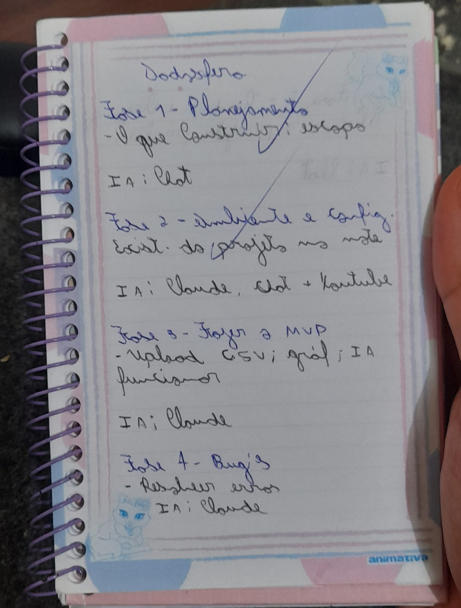
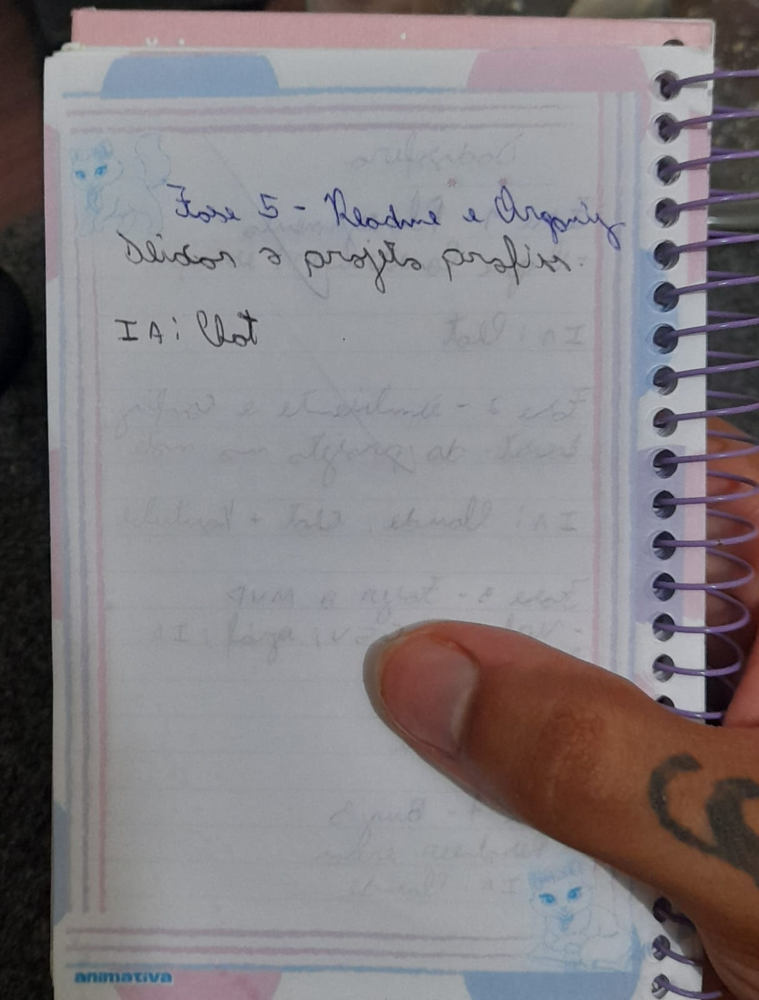
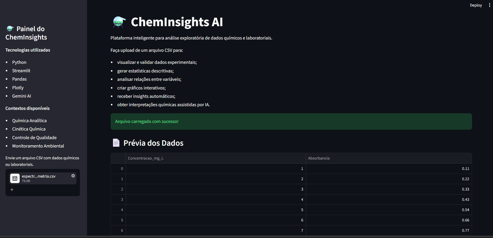
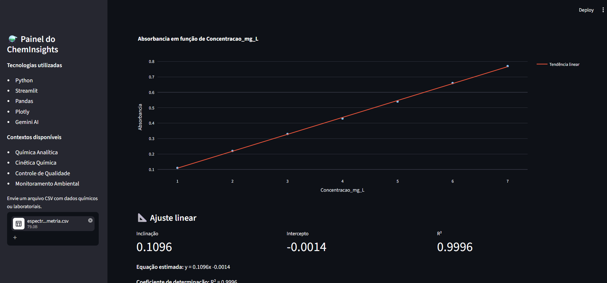
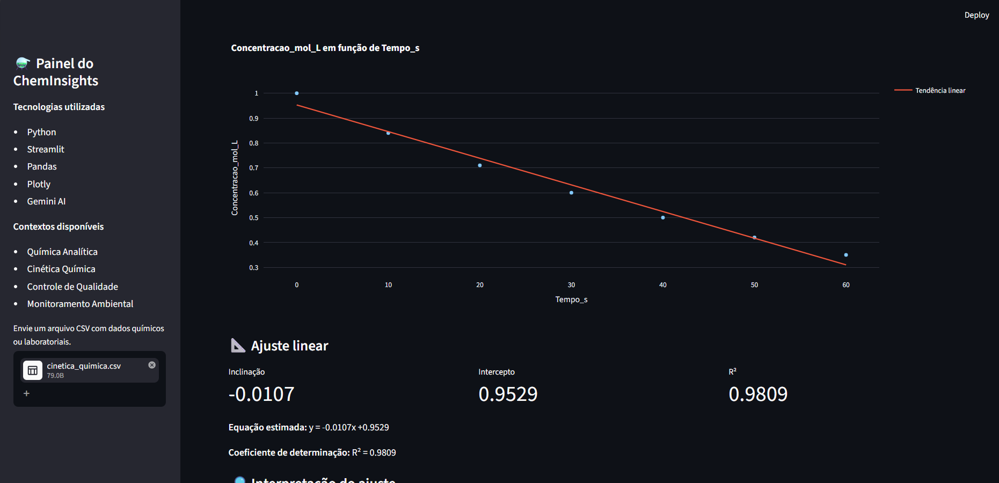
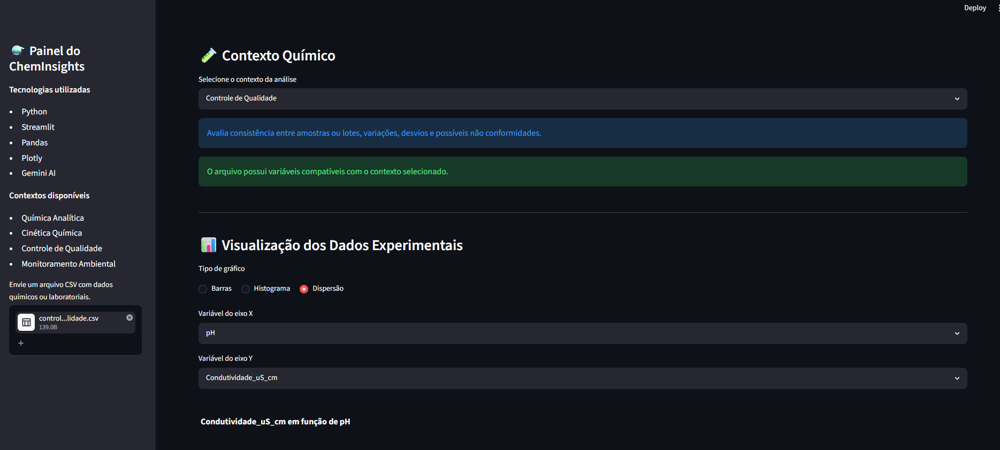
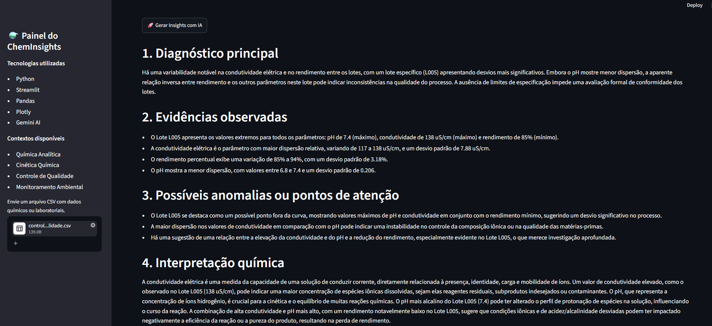

# ⚗️ ChemInsights AI

> Plataforma de análise exploratória de dados químicos e laboratoriais que combina cálculos determinísticos em Python, regras químicas explícitas, visualizações interativas e interpretação complementar com IA generativa.

**Tecnologias:** Python • Streamlit • Pandas • NumPy • Plotly • Google Gemini

**Status:** ✅ MVP funcional, documentado e validado localmente

[▶️ Assistir à demonstração no YouTube](https://www.youtube.com/watch?v=0xRKUme1pbs)

---

## 📑 Sumário

* [Sobre o projeto](#-sobre-o-projeto)
* [Problema que resolve](#-problema-que-resolve)
* [Evolução do projeto](#-evolução-do-projeto)
* [Contextos químicos](#-contextos-químicos-disponíveis)
* [Funcionalidades](#-funcionalidades)
* [Regressão linear](#-regressão-linear-e-interpretação)
* [Camadas de análise](#-camadas-de-análise)
* [Arquitetura](#️-arquitetura-do-funcionamento)
* [Estrutura do projeto](#-estrutura-do-projeto)
* [Tecnologias](#️-tecnologias-utilizadas)
* [Como executar](#-como-executar-localmente)
* [Demonstração](#-demonstração)
* [Uso de IA](#-uso-de-ia-no-desenvolvimento)
* [Confiabilidade](#️-confiabilidade-da-integração-com-ia)
* [Limitações](#️-limitações-conhecidas)
* [Melhorias futuras](#-melhorias-futuras)
* [Autor](#-autor)

---

## 📌 Sobre o projeto

O **ChemInsights AI** é uma aplicação web desenvolvida para auxiliar estudantes, químicos, pesquisadores e profissionais de laboratório na exploração inicial de dados químicos armazenados em arquivos CSV.

O sistema permite:

* carregar dados experimentais;
* visualizar e validar a estrutura do dataset;
* calcular estatísticas descritivas;
* criar gráficos interativos;
* realizar regressão linear;
* calcular inclinação, intercepto e coeficiente de determinação `R²`;
* identificar relações químicas por meio de regras determinísticas;
* verificar se o dataset combina com o contexto químico selecionado;
* sugerir automaticamente os eixos mais adequados;
* receber interpretações químicas complementares com IA.

O objetivo não é substituir a avaliação de um especialista nem realizar a validação formal de um método experimental.

A proposta é reduzir a distância entre:

> possuir dados laboratoriais e conseguir iniciar uma interpretação técnica estruturada.

---

## 🎯 Problema que resolve

Dados químicos frequentemente chegam em planilhas ou arquivos CSV contendo variáveis como:

* concentração;
* absorbância;
* tempo;
* temperatura;
* pH;
* condutividade;
* rendimento;
* salinidade;
* nitrato;
* fosfato;
* identificação de lotes;
* pontos de coleta.

A interpretação inicial desses dados pode exigir conhecimentos simultâneos de química, estatística e visualização.

O ChemInsights AI organiza esse processo em uma única interface, oferecendo:

* cálculos verificáveis;
* visualizações interativas;
* regras de domínio explícitas;
* orientação didática;
* interpretação contextualizada.

---

## 🔄 Evolução do projeto

O projeto surgiu inicialmente como **AI Data Insights**, um analisador genérico de arquivos CSV.

Após a primeira avaliação do processo seletivo, foi recebido o seguinte feedback:

> “Faça o app mais aplicado em conceitos avançados de química. Está muito genérico.”

Em vez de abandonar a versão funcional e começar novamente, a arquitetura existente foi reaproveitada e especializada para o domínio químico.

Essa decisão permitiu:

* preservar funcionalidades já validadas;
* evitar uma reconstrução completa;
* reduzir retrabalho;
* diminuir o risco técnico;
* aproveitar o prazo de forma estratégica;
* demonstrar capacidade de adaptação de produto;
* transformar uma solução genérica em uma aplicação de domínio.

---

## 📝 Planejamento inicial

Antes e durante o desenvolvimento, foram elaborados rascunhos para organizar:

* escopo do MVP;
* etapas de implementação;
* prioridades;
* funcionalidades essenciais;
* arquitetura inicial;
* uso de IA;
* validação dos resultados;
* correção de erros.

### Planejamento — parte 1



### Planejamento — parte 2



Esses materiais representam o processo de raciocínio e evolução do projeto, e não apenas o resultado final.

---

## 🧪 Contextos químicos disponíveis

O usuário seleciona o contexto mais adequado ao seu conjunto de dados.

### 1. Química Analítica

Voltada principalmente para:

* concentração;
* absorbância;
* espectrofotometria;
* curvas analíticas;
* comportamento linear;
* Lei de Beer-Lambert;
* limitações da validação de métodos.

Quando o sistema reconhece concentração e absorbância, recomenda:

```text
Eixo X: concentração
Eixo Y: absorbância
```

Um `R²` alto pode indicar bom ajuste linear, mas não representa sozinho a validação completa de um método analítico.

### 2. Cinética Química

Voltada para:

* variação da concentração ao longo do tempo;
* consumo de reagentes;
* formação de produtos;
* tendências cinéticas;
* influência da temperatura;
* condições experimentais.

Quando reconhece tempo e concentração, recomenda:

```text
Eixo X: tempo
Eixo Y: concentração
```

O sistema não determina automaticamente a ordem ou o mecanismo da reação apenas com base em uma correlação linear.

### 3. Controle de Qualidade

Voltado para:

* comparação entre lotes;
* consistência entre amostras;
* pH;
* condutividade;
* rendimento;
* dispersão;
* possíveis desvios;
* necessidade de limites de especificação.

O sistema diferencia:

* valor diferente;
* possível anomalia;
* não conformidade.

Uma não conformidade só pode ser declarada quando limites de referência ou especificações estiverem disponíveis.

### 4. Monitoramento Ambiental

Voltado para:

* qualidade da água;
* parâmetros físico-químicos;
* pH;
* salinidade;
* condutividade;
* nitrato;
* fosfato;
* diferenças entre pontos de coleta;
* possíveis fontes de alteração ambiental.

O sistema evita declarar contaminação ou risco ambiental definitivo sem normas, valores de referência ou contexto amostral adequado.

---

## ✨ Funcionalidades

| Funcionalidade              | Descrição                                                     |
| --------------------------- | ------------------------------------------------------------- |
| 📁 Upload de CSV            | Carrega arquivos com diferentes separadores e codificações    |
| 📄 Prévia dos dados         | Exibe o DataFrame carregado                                   |
| 📌 Informações gerais       | Mostra quantidade de linhas e colunas                         |
| 🧩 Tipos de dados           | Identifica o tipo de cada variável                            |
| 🧪 Contexto químico         | Permite selecionar uma das quatro áreas disponíveis           |
| ✅ Compatibilidade           | Verifica se o CSV possui variáveis relevantes para o contexto |
| 📊 Gráfico de barras        | Exibe a distribuição de valores                               |
| 📈 Histograma               | Analisa a distribuição de variáveis numéricas                 |
| 🔬 Dispersão                | Compara duas variáveis numéricas                              |
| 📐 Regressão linear         | Calcula linha de tendência, inclinação, intercepto e `R²`     |
| 🧭 Sugestão de eixos        | Recomenda X e Y de acordo com o contexto químico              |
| 📚 Explicações didáticas    | Explica estatísticas, regressão e limites de interpretação    |
| 🧠 Insights determinísticos | Aplica regras químicas executadas diretamente em Python       |
| 🤖 Insights com IA          | Gera interpretação complementar com Google Gemini             |
| 🔁 Fallback de modelos      | Tenta modelos alternativos caso o principal falhe             |
| 🛡️ Tratamento de erros     | Apresenta mensagens amigáveis em falhas da API                |

---

## 📐 Regressão linear e interpretação

No gráfico de dispersão, o sistema calcula uma equação no formato:

```text
y = ax + b
```

Em que:

* `a` representa a inclinação;
* `b` representa o intercepto;
* `x` representa a variável independente;
* `y` representa a variável analisada.

### Inclinação

A inclinação indica quanto a variável `Y` tende a variar quando `X` aumenta uma unidade.

* inclinação positiva: tendência de aumento;
* inclinação negativa: tendência de diminuição;
* inclinação próxima de zero: pouca variação média linear.

### Intercepto

O intercepto representa o valor estimado de `Y` quando `X = 0`.

Sua interpretação depende do contexto experimental e não deve ser feita isoladamente.

### Coeficiente de determinação — R²

O `R²` indica quanto da variação observada em `Y` é representada pelo modelo linear.

Em geral:

* próximo de `1`: forte representação linear;
* próximo de `0`: baixa capacidade explicativa do modelo linear.

O sistema apresenta avisos para evitar conclusões inadequadas:

* `R²` alto não prova causalidade;
* `R²` alto não valida sozinho um método analítico;
* linearidade entre concentração e tempo não determina automaticamente a ordem da reação;
* correlação não comprova um mecanismo químico.

---

## 🧠 Camadas de análise

O ChemInsights AI foi organizado em três camadas complementares.

```text
1. Python
   ↓
Cálculos estatísticos e regressão linear

2. Regras químicas determinísticas
   ↓
Reconhecimento de variáveis e padrões verificáveis

3. Gemini
   ↓
Interpretação contextual, hipóteses e recomendações
```

### Cálculos determinísticos

São realizados diretamente em Python:

* média;
* mínimo;
* máximo;
* desvio padrão;
* correlação;
* regressão linear;
* inclinação;
* intercepto;
* `R²`.

### Regras químicas

Exemplos:

* detecção de diminuição da concentração ao longo do tempo;
* reconhecimento da relação entre concentração e absorbância;
* validação básica do intervalo convencional de pH;
* identificação das variáveis esperadas em cada contexto;
* verificação de compatibilidade;
* recomendação dos eixos do gráfico.

### Inteligência artificial

A IA é utilizada para:

* organizar o diagnóstico;
* destacar evidências;
* levantar hipóteses;
* apontar limitações;
* sugerir análises ou experimentos adicionais;
* traduzir resultados para uma linguagem técnica acessível.

A IA não é responsável pelos principais cálculos numéricos do sistema.

---

## 🏗️ Arquitetura do funcionamento

```text
Arquivo CSV
    ↓
Leitura e validação com Pandas
    ↓
DataFrame
    ↓
Identificação de tipos e variáveis químicas
    ↓
Seleção do contexto químico
    ↓
Verificação de compatibilidade
    ↓
Estatísticas e gráficos
    ↓
Regressão linear e interpretação didática
    ↓
Insights químicos determinísticos
    ↓
Gemini AI — análise complementar opcional
```

---

## 📂 Estrutura do projeto

```text
cheminsight-ai/
│
├── app.py
├── README.md
├── ROADMAP.md
├── uso_da_IA.md
├── requirements.txt
├── .gitignore
├── .env.example
├── test_gemini.py
│
├── utils/
│   ├── ai_insights.py
│   ├── charts.py
│   ├── chemical_analysis.py
│   └── insights.py
│
├── docs/
│   ├── planejamento_inicial_01.jpeg
│   └── planejamento_inicial_02.jpeg
│
└── images/
    ├── cheminsights_visao_geral.png
    ├── quimica_analitica_regressao.png
    ├── cinetica_quimica_regressao.png
    ├── controle_qualidade_insights_ia.png
    ├── validacao_contexto_eixos.png
    └── versao_anterior/
```

### Responsabilidades dos módulos

| Arquivo                      | Responsabilidade                                               |
| ---------------------------- | -------------------------------------------------------------- |
| `app.py`                     | Interface, fluxo principal e controle das seções do Streamlit  |
| `utils/charts.py`            | Gráficos, regressão linear e indicadores matemáticos           |
| `utils/insights.py`          | Estatísticas e insights químicos determinísticos               |
| `utils/chemical_analysis.py` | Reconhecimento de colunas, compatibilidade e sugestão de eixos |
| `utils/ai_insights.py`       | Prompt, integração com Gemini, fallback e tratamento de erros  |
| `test_gemini.py`             | Teste manual e isolado da conexão com a API                    |

A separação em módulos evita concentrar todas as regras, cálculos e integrações diretamente no arquivo principal.

---

## 🛠️ Tecnologias utilizadas

| Tecnologia        | Papel no projeto                         |
| ----------------- | ---------------------------------------- |
| Python            | Linguagem principal                      |
| Streamlit         | Construção da interface web              |
| Pandas            | Leitura, organização e análise dos dados |
| NumPy             | Regressão e cálculos numéricos           |
| Plotly            | Gráficos interativos                     |
| Google Gemini API | Interpretação química complementar       |
| python-dotenv     | Leitura das variáveis de ambiente        |
| Git e GitHub      | Versionamento e publicação               |

---

## 🚀 Como executar localmente

### Pré-requisitos

* Python 3.11 ou superior;
* Git;
* uma chave da API do Google Gemini.

### 1. Clone o repositório

```bash
git clone https://github.com/Victor-h-hub/cheminsight-ai.git
cd cheminsight-ai
```

### 2. Crie o ambiente virtual

```bash
python -m venv .venv
```

### 3. Ative o ambiente virtual

#### Windows PowerShell

```powershell
.\.venv\Scripts\Activate.ps1
```

Caso o PowerShell bloqueie a execução:

```powershell
Set-ExecutionPolicy -Scope Process -ExecutionPolicy RemoteSigned
.\.venv\Scripts\Activate.ps1
```

#### Linux ou macOS

```bash
source .venv/bin/activate
```

### 4. Instale as dependências

```bash
pip install -r requirements.txt
```

### 5. Configure a chave do Gemini

Copie o arquivo:

```text
.env.example
```

e crie um novo arquivo chamado:

```text
.env
```

Use o seguinte formato:

```env
GEMINI_API_KEY=sua_chave_aqui
```

> O `.env` está protegido pelo `.gitignore` e não deve ser enviado ao GitHub.

### 6. Execute a aplicação

```bash
streamlit run app.py
```

A aplicação ficará disponível em:

```text
http://localhost:8501
```

---

## 📸 Demonstração

### Visão geral do sistema



### Química Analítica — concentração e absorbância



### Cinética Química — tempo e concentração



### Validação do contexto e sugestão de eixos



### Controle de Qualidade com IA



---

## 🎥 Vídeo demonstrativo

[▶️ Assista à demonstração do ChemInsights AI no YouTube](https://www.youtube.com/watch?v=0xRKUme1pbs)

O vídeo apresenta:

* o problema escolhido;
* a evolução do projeto;
* o fluxo da aplicação;
* os contextos químicos;
* a regressão linear;
* os insights determinísticos;
* a integração com Gemini;
* a arquitetura;
* as limitações;
* os próximos passos.

---

## 🤖 Uso de IA no desenvolvimento

A IA foi utilizada como:

* professora de programação;
* apoio à arquitetura;
* ferramenta de brainstorming;
* auxílio na depuração;
* revisora de código;
* suporte à engenharia de prompt;
* auxílio na documentação.

Foram utilizadas as ferramentas:

* ChatGPT;
* Claude;
* Google Gemini.

As sugestões não foram aceitas automaticamente.

### Exemplos de revisão crítica

Durante o projeto, sugestões de IA foram avaliadas e corrigidas quando:

* utilizaram modelos Gemini descontinuados;
* apresentaram código incompatível com a versão do SDK;
* geraram problemas de indentação;
* sugeriram conclusões químicas excessivas;
* confundiram correlação com causalidade;
* trataram um `R²` alto como validação completa;
* propuseram funcionalidades maiores do que o prazo permitia;
* produziram mensagens técnicas inadequadas para o usuário final.

Também foram rejeitadas sugestões de complexidade incompatível com o MVP, como:

* banco de dados;
* autenticação;
* múltiplos provedores;
* machine learning;
* arquitetura excessivamente fragmentada.

A documentação completa está disponível em:

📄 [Uso da IA no desenvolvimento](uso_da_IA.md)

---

## 🛡️ Confiabilidade da integração com IA

A integração utiliza uma sequência de modelos alternativos.

Caso o primeiro modelo esteja indisponível, o sistema tenta os seguintes.

São tratadas situações como:

* alta demanda;
* indisponibilidade temporária;
* limite de cota;
* resposta vazia;
* falha de autenticação;
* chave ausente.

Os detalhes técnicos são registrados no terminal, enquanto o usuário recebe uma mensagem mais clara.

Mesmo sem a IA, continuam disponíveis:

* upload;
* prévia dos dados;
* estatísticas;
* gráficos;
* regressão linear;
* validação do contexto;
* sugestão de eixos;
* insights determinísticos.

---

## 📚 Principais aprendizados

Durante o desenvolvimento, foram trabalhados conceitos de:

* ciclo de execução do Streamlit;
* `st.session_state`;
* leitura e validação de CSV;
* organização de DataFrames;
* modularização;
* tratamento de exceções;
* variáveis de ambiente;
* consumo de APIs;
* fallback de serviços;
* regressão linear;
* correlação;
* `R²`;
* análise exploratória;
* química analítica;
* cinética química;
* controle de qualidade;
* monitoramento ambiental;
* uso crítico de IA;
* versionamento com Git.

---

## ⚠️ Limitações conhecidas

* A identificação das variáveis depende parcialmente dos nomes das colunas.
* Nomes incomuns podem não ser reconhecidos automaticamente.
* A aplicação realiza análise exploratória, não validação formal de métodos.
* O `R²` não deve ser utilizado isoladamente para avaliar uma curva analítica.
* A análise de cinética não determina automaticamente a ordem da reação.
* A aplicação não substitui uma avaliação profissional ou protocolo laboratorial.
* A classificação de conformidade exige limites ou valores de referência.
* A interpretação ambiental exige comparação com normas adequadas.
* A IA pode ficar temporariamente indisponível ou atingir limites de uso.
* Datasets pequenos reduzem a robustez das conclusões.
* Datasets muito grandes podem reduzir o desempenho da interface.
* O arquivo principal ainda concentra grande parte da interface do Streamlit e poderia ser refatorado em uma evolução futura.

---

## 🔭 Melhorias futuras

* [ ] Comparação entre modelos integrados de cinética química;
* [ ] análise de resíduos da regressão;
* [ ] coeficiente de variação;
* [ ] identificação automática de outliers;
* [ ] boxplots para controle de qualidade;
* [ ] limites de especificação configuráveis;
* [ ] comparação com referências ambientais;
* [ ] suporte a arquivos Excel;
* [ ] exportação de relatórios;
* [ ] testes automatizados;
* [ ] refatoração das seções da interface;
* [ ] deploy em ambiente público.

Essas funcionalidades foram mantidas como evolução futura para preservar a simplicidade e a estabilidade do MVP.

---

## 👤 Autor

**Victor Hugo Paiva Rocha de Oliveira**

Estudante de Química — Instituto Federal de Educação, Ciência e Tecnologia do Rio Grande do Norte

* [LinkedIn](https://www.linkedin.com/in/victor-hugo-paiva-rocha-de-oliveira-0a5902225/)
* [GitHub](https://github.com/Victor-h-hub/cheminsight-ai)

---

> Projeto desenvolvido para a segunda fase do processo seletivo de Engenharia de Soluções Júnior/Trainee da Dadosfera, em 2026.
